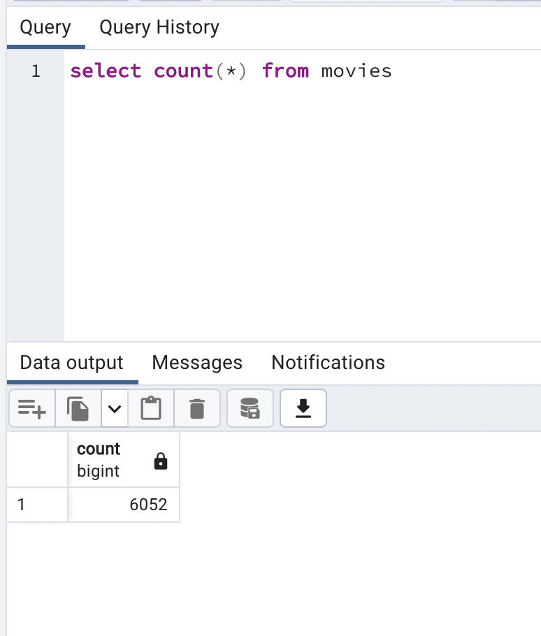
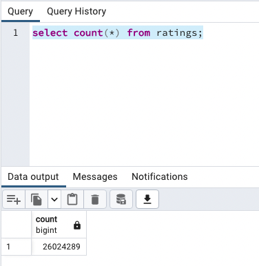

# Movies- Extract, Transform, and Load

## Purpose
Creating an automated pipeline that takes in new data, performs the appropriate transformations, and loads the data into existing tables for a hackathon event.

## Process
### Extract
Created one function to read the three files: Wikipedia data, Kaggle metadata, and the MovieLens rating data into pandas.

### Transform the Data
Inspected and cleaned two sources of data: Wikipedia and Kaggle

### Load
Loaded the final output into a database with sqlalchemy

## Results

Final database output for the movie query:

Final database output for the ratings query:

## Resources
Jupyter Notebook 6.4.8
Python 3.9.12
PgAdmin Version 6.10 (4280.88)
